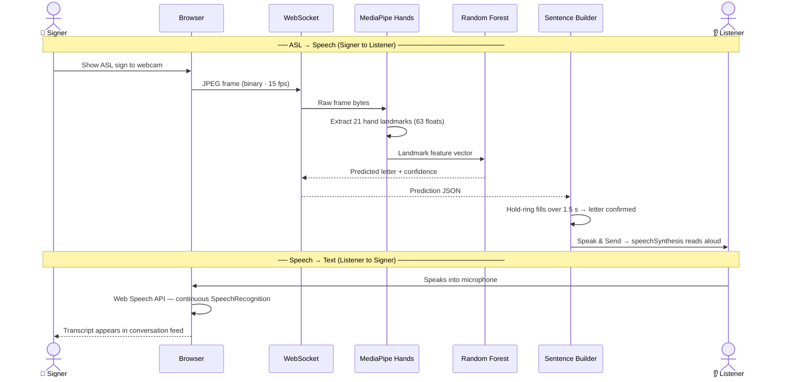

# 🖐️ SignBridge

<div align="center">


</div>

> Real-time, two-way ASL ↔ Speech communication. SignBridge is an innovative application designed to bridge the communication gap between deaf/hard-of-hearing individuals and hearing individuals seamlessly. <br/>
* **Signer → Listener:** Sign into your webcam, and the app translates your ASL gestures into spoken words.<br/>
* **Listener → Signer:** Speak into the microphone, and the app transcribes your words into text.

<br/>

<div align="center">

  [](https://opensource.org/licenses/Apache-2.0)
  [](https://www.python.org/downloads/)
  [](https://nodejs.org/)
  [](https://www.typescriptlang.org/)
  [](https://fastapi.tiangolo.com/)
  [](https://reactjs.org/)
</div>

---

## 📸 See it in Action

<div align="center">
  
</div>

---

## ✨ Key Features

- ⚡ **Real-time Sign Detection:** Utilizes a 21-landmark MediaPipe pipeline with single-frame WebSocket inference to ensure zero-queue latency.
- 🎯 **Hold-to-Confirm Interaction:** Features an intuitive hold-ring mechanism (1.5s) to confirm letters, preventing accidental inputs and typos.
- 🗣️ **Two-way Translation:** Bridges the gap fully—Signer to Text-to-Speech (TTS), and Listener to Speech-to-Text (STT).
- 🌗 **Premium Neumorphic UI:** Boasts beautiful dark and light modes with smooth Framer Motion animations for a modern feel.
- 🧪 **Rock-Solid Reliability:** Backed by 91 automated tests (59 frontend Vitest + 32 backend pytest) to ensure stability.

---

## 🏗️ Architecture & Flow

SignBridge uses a high-performance WebSocket architecture to stream binary JPEG frames to a Python backend, process them via MediaPipe and a Random Forest classifier, and return predictions instantly.



---

## 🛠️ Tech Stack

<details>
<summary><b>Click to expand technology details</b></summary>
<br/>

| Layer | Technology | Purpose |
|---|---|---|
| **Frontend** | React 19 + Vite + TypeScript | UI and camera capture |
| **Styling** | Tailwind CSS v4 + custom neumorphic system | Dark/light neumorphism theme |
| **Animations** | Framer Motion | Transitions, ripple rings, entrance choreography |
| **Backend** | FastAPI + Uvicorn | WebSocket endpoint, inference API |
| **Hand Tracking** | MediaPipe Hands | 21-landmark extraction (63 floats per frame) |
| **Classifier** | scikit-learn Random Forest | Letter prediction from landmarks |
| **Real-time** | WebSocket binary frames | JPEG bytes → JSON prediction |
| **Speech** | Web Speech API | TTS (`speechSynthesis`) + STT (`SpeechRecognition`) |

</details>

---

## 🚀 Getting Started

### Prerequisites
Make sure you have **Python 3.10+**, **Node.js 18+**, a working webcam, and **Chrome/Edge** (for Speech-to-Text).

### 1. Clone & Setup
```bash
git clone https://github.com/pvchaitanya8/Sign-Language-Translator.git
cd Sign-Language-Translator
```

### 2. Backend Environment
```bash
cd backend
python -m venv venv

# Activate the virtual environment:
# Windows: venv\Scripts\activate
# Mac/Linux: source venv/bin/activate

pip install -r requirements.txt
```

### 3. Model Training
*(Skip if `backend/model/asl_model.pkl` is already present)*

Download the [Kaggle ASL Alphabet dataset](https://www.kaggle.com/datasets/grassknoted/asl-alphabet) and place the `train/` and `test/` folders inside `backend/dataset/`.
```bash
# Process images to extract landmarks (~2-5 mins)
python model/preprocess.py

# Train the Random Forest classifier (~30s)
python model/train.py
```

### 4. Run the Application

**Terminal 1 (Backend):**
```bash
cd backend
uvicorn main:app --reload --port 8000
```
*API health check:* [http://localhost:8000/health](http://localhost:8000/health)

**Terminal 2 (Frontend):**
```bash
cd frontend
npm install
npm run dev
```
*App interface:* [http://localhost:5173](http://localhost:5173)

---

## 📖 Usage Guide

<details>
<summary><b>Signing a message (Signer → Listener)</b></summary>

1. **Show your hand** to the camera.
2. A prediction overlay appears with the detected letter and confidence percentage.
3. The **ring disc** in the Sentence Builder fills clockwise as you hold the sign.
4. **Hold for 1.5 seconds** → the letter is confirmed and appended to your sentence.
5. Special signs:
   - `SPACE`: Adds a space between words
   - `DEL`: Removes the last character
6. Click **Speak & Send** to read the sentence aloud via Text-to-Speech.
</details>

<details>
<summary><b>Replying by voice (Listener → Signer)</b></summary>

1. Click the **mic button** (bottom-right) — ripple rings will pulse.
2. Speak naturally; interim text appears dynamically.
3. Click the mic button again to stop. Your speech is transcribed to text.
</details>

<details>
<summary><b>ASL Classes Supported</b></summary>

The model recognises **29 classes**: `A-Z`, `space`, `del`, and `nothing`. 
*Note: `J` and `Z` involve motion and have reduced accuracy in this static-landmark model.*
</details>

---

## 🧪 Testing

SignBridge is heavily tested to ensure reliability.

**Backend (pytest):**
```bash
cd backend
pip install -r requirements-dev.txt
pytest -v
```

**Frontend (Vitest):**
```bash
cd frontend
npm run test:run
```

---

## ⚙️ Configuration & API

<details>
<summary><b>Environment Variables</b></summary>

For production, create `frontend/.env.local`:
```env
VITE_WS_URL=wss://your-app.onrender.com/ws
```
</details>

<details>
<summary><b>WebSocket API (<code>/ws</code>)</b></summary>

Accepts raw JPEG bytes. Returns JSON predictions:
```jsonc
{
  "hand_detected": true,
  "letter": "A",
  "confidence": 0.94
}
```
</details>

---


## 💖 Support

Consider supporting by:

<p align="center">
  <a href="https://patreon.com/Chaitanya888"></a>
  &nbsp;
  <a href="https://buymeacoffee.com/chaitanya888"></a>
</p>

<br/>

---


## 📜 License
Distributed under the Apache-2.0 License. See [LICENSE](./LICENSE) for more information.

---
